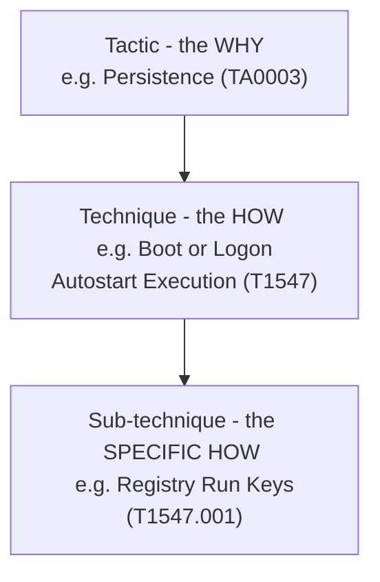

# MITRE ATT&CK Primer

[MITRE ATT&CK](https://attack.mitre.org) is a knowledge base of adversary behavior built from real-world observed intrusions. This guide uses it as its tagging system: every persistence mechanism, and most artifact and playbook pages, carry an ATT&CK ID so you can pivot straight to MITRE's own detection and mitigation guidance.

## The hierarchy

- **Tactics** answer *why* an adversary is doing something. Enterprise ATT&CK defines 14: Reconnaissance, Resource Development, Initial Access, Execution, Persistence, Privilege Escalation, Defense Evasion, Credential Access, Discovery, Lateral Movement, Collection, Command and Control, Exfiltration, and Impact.
- **Techniques** (and **sub-techniques**) answer *how*. A Persistence tactic can be achieved via dozens of techniques — a Registry Run key, a Scheduled Task, a malicious service, a WMI event subscription — each with its own ID, such as `T1547.001`.

## How IDs are used in this guide

Every entry in the [Persistence Catalog](../05-persistence/index.md) is tagged with its sub-technique ID. This does two things: it gives you a stable identifier to search on (in Sentinel, in a SIEM, in a ticket), and it means you can pivot to MITRE's own page for detection data sources and mitigations without this guide needing to duplicate that content.

!!! tip "Read technique IDs as a lookup key, not trivia"
    You don't need to memorize IDs. Treat `T1547.001` the way you'd treat a CVE number — a stable reference you look up when you need it.

## Sources

- [MITRE ATT&CK for Enterprise](https://attack.mitre.org)
