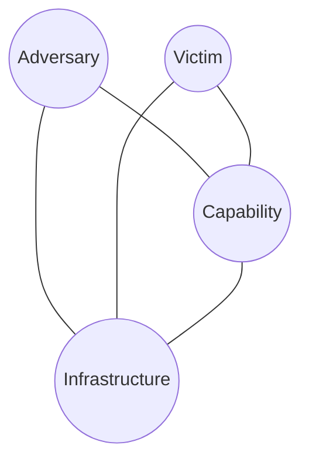

---
tags:
  - Foundations
---

# The Diamond Model of Intrusion Analysis

Developed by Caltagirone, Pendergast, and Betz, the Diamond Model gives you a minimal, consistent frame for describing any single malicious event: four core features connected in a diamond, because each one is directly related to the other three.

- **Adversary** — who's doing this (an individual, group, or organization — often unknown early on, and that's fine)
- **Capability** — the tools and techniques used (malware, an exploit, a phishing kit, a living-off-the-land technique)
- **Infrastructure** — the physical/logical means used to deliver capability or maintain control (C2 domains, IPs, compromised relay hosts, mailboxes)
- **Victim** — the target (an organization, a system, a person, an asset)

Around the core diamond, six meta-features add context to each event: **timestamp**, **phase** (where it sits in the kill chain), **result**, **direction** (e.g., victim-to-infrastructure), **methodology** (e.g., phishing, DDoS), and **resources** (what the adversary needed to pull it off).

## Why it earns a page in a Windows-focused guide

Individual artifact pages in this guide tell you *what happened on one host*. The Diamond Model is how you connect several of those events into a coherent narrative: this Prefetch entry (Capability) executed from this compromised account (Victim/Adversary access), reaching out to this C2 domain (Infrastructure). Use it to structure investigation notes and incident write-ups so the next analyst — or your future self — can reconstruct the reasoning, not just the raw findings.

<!-- BACKLINKS:START -->
## Referenced From

- [Module 0: Foundations](index.md)
- [Reporting & Communication](reporting-and-communication.md)
- [Timeline Construction & Correlation](timeline-construction.md)

<!-- BACKLINKS:END -->

## Sources

- Caltagirone, Pendergast, and Betz, *The Diamond Model of Intrusion Analysis* (2013)
