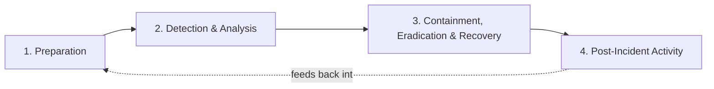

# The Incident Response Lifecycle

Two frameworks describe the same underlying process. You'll see both cited in the field — know them as synonyms, not competitors.

## NIST SP 800-61: four phases

NIST's Computer Security Incident Handling Guide (SP 800-61 Rev. 2) defines four phases, drawn as a cycle rather than a line because the last phase feeds back into the first:

- **Preparation** — everything done *before* an incident: logging enabled and shipped somewhere durable, EDR deployed, an IR plan written and rehearsed, contact lists current, jump-bag tooling ready.
- **Detection & Analysis** — the phase this entire guide mostly lives in: recognizing that something happened, scoping what, and confirming it isn't a false positive.
- **Containment, Eradication & Recovery** — stopping the bleeding (isolate a host, disable an account, block a domain), removing the cause (kill persistence, rebuild a host), and returning to normal operations.
- **Post-Incident Activity** — the retrospective: what worked, what didn't, what should change in Preparation next time. Skipping this is the single most common reason organizations relearn the same lesson twice.

## SANS PICERL: six phases

SANS teaches a six-phase model that is really the same lifecycle with Containment/Eradication/Recovery split apart, because in practice they are distinct decisions with different urgency:

| PICERL phase | Roughly maps to NIST phase | Core question |
|---|---|---|
| Preparation | Preparation | Are we ready before anything happens? |
| Identification | Detection & Analysis | Did something actually happen? |
| Containment | Containment/Eradication/Recovery | How do we stop it from getting worse *right now*? |
| Eradication | Containment/Eradication/Recovery | How do we remove the attacker's access and tooling completely? |
| Recovery | Containment/Eradication/Recovery | How do we safely return to normal operations? |
| Lessons Learned | Post-Incident Activity | What changes so this doesn't happen the same way twice? |

## Why the split matters in practice

Treating Containment, Eradication, and Recovery as one blurred step is how organizations contain an incident, declare victory, and get re-compromised through the same persistence mechanism a week later. A concrete example: disabling a compromised account (**containment**) is not the same action as revoking its tokens and resetting hybrid credentials twice (**eradication**), which is not the same action as re-enabling access with monitoring in place (**recovery**). Every playbook in [Module 8](../08-playbooks/index.md) keeps these as separate, explicit steps.

!!! success "Baseline habit"
    Before closing an incident, walk through all six PICERL phases by name and confirm each one actually happened — not just that the immediate symptom stopped.

## Sources

- NIST SP 800-61 Rev. 2, *Computer Security Incident Handling Guide*
- [SANS FOR508: Advanced Incident Response, Threat Hunting, and Digital Forensics](https://www.sans.org/cyber-security-courses/advanced-incident-response-threat-hunting-training)
