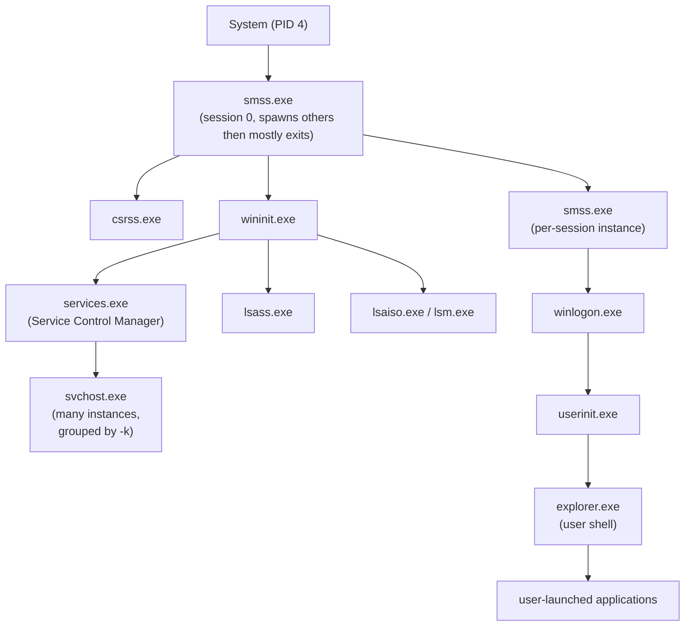

---
tags:
  - Windows Endpoint
  - T1036
  - T1055
  - T1204
---

# Baseline Process Trees

Knowing what's abnormal requires knowing what's normal first. A handful of core Windows processes have parent/child relationships that essentially never legitimately vary — which makes deviations from them some of the highest-confidence detections available on an endpoint.

## The normal boot-time tree

## The relationships worth memorizing

| Process | Normal parent | Notes |
|---|---|---|
| `smss.exe` | `System` (PID 4) | The very first user-mode process; spawns a per-session copy of itself then mostly exits |
| `csrss.exe` | `smss.exe` | Should never have any other parent |
| `wininit.exe` | `smss.exe` | One instance, session 0 |
| `services.exe` | `wininit.exe` | The Service Control Manager — parent to most `svchost.exe` instances |
| `lsass.exe` | `wininit.exe` | **Exactly one instance should ever exist.** Any other parent, or a second instance, is a serious red flag |
| `svchost.exe` | `services.exe` | Should always run with a `-k <group>` argument identifying its service group |
| `winlogon.exe` | `smss.exe` (per-session) | One per interactive session |
| `explorer.exe` | `userinit.exe` | The user shell; `userinit.exe` itself exits shortly after spawning it, so `explorer.exe` often shows as parentless in a live snapshot — that's normal, not suspicious, on its own |

## Red flags

- **`lsass.exe` with any parent other than `wininit.exe`, or more than one running instance.** This is one of the single highest-confidence process-tree detections available — legitimate Windows never does this.
- **`svchost.exe` with a parent other than `services.exe`**, or running without a `-k` group argument.
- **Office applications (`winword.exe`, `excel.exe`, `outlook.exe`) spawning `cmd.exe`, `powershell.exe`, or `wscript.exe`/`cscript.exe`.** Legitimate document workflows essentially never do this — it's a classic macro-based initial-access signature.
- **`explorer.exe` spawning `powershell.exe` with obfuscated or encoded arguments**, rather than a normal interactive prompt.
- **Any process with a Microsoft-signed name running from a non-standard path** — `C:\Users\...\svchost.exe` is not `svchost.exe`, it's malware borrowing a trusted name.
- **A short-lived parent process that immediately spawns a long-running child and exits**, especially where the parent itself came from an unusual source (a downloaded file, a script interpreter, a scheduled task) — a common pattern for masking a process's true origin.

!!! success "Baseline"
    Every core system process has exactly the parent listed in the table above, running from its standard path.

!!! danger "Red flag"
    `lsass.exe` or `svchost.exe` with an unexpected parent, an Office app spawning a shell, or a system-process name running from a non-standard location.

## How to check this

Live: Sysmon Event ID 1 records parent process explicitly and is far easier to query at scale than manually walking a process tree. Offline/memory: [Volatility 3's `pstree`](../03-memory-forensics/index.md) reconstructs the same relationships from a memory capture, including for processes that have since exited.

## ATT&CK mapping

Process-tree anomalies are frequently the first observable for [T1055 (Process Injection)](https://attack.mitre.org/techniques/T1055/), [T1036 (Masquerading)](https://attack.mitre.org/techniques/T1036/), and initial-access techniques delivered via [T1204 (User Execution)](https://attack.mitre.org/techniques/T1204/) of a malicious document.

!!! tip "Practice this"
    [Process Tree Triage](../practice-drills/process-tree-drill.md) hides one spoofed-parentage process in an otherwise-normal listing — see if you can spot it before checking the answer.

<!-- BACKLINKS:START -->
## Referenced From

- [Module 1: Windows Endpoint Forensics](index.md)
- [EPROCESS Internals](../03-memory-forensics/eprocess-internals.md)
- [Injection Techniques: What Each Looks Like in Memory](../03-memory-forensics/injection-techniques.md)
- [LSASS Memory Analysis & Credential Theft](../03-memory-forensics/lsass-memory-analysis.md)
- [Malware Triage Methodology](../03-memory-forensics/malware-triage-methodology.md)
- [Mutex (Mutant) Analysis](../03-memory-forensics/mutex-analysis.md)
- [Process Analysis: Finding What's Hidden](../03-memory-forensics/volatility-process-analysis.md)
- [PowerShell Forensics: Malicious Cmdlet Patterns](../04-powershell-forensics/powershell-malicious-patterns.md)
- [Persistence: LSA Provider / Security Support Provider Abuse](../05-persistence/lsa-ssp.md)
- [The Entra Connect Server: A Target in Its Own Right](../06-cloud-identity/entra-connect-as-target.md)
- [Advanced Hunting with KQL](../07-defender-suite/advanced-hunting-kql.md)
- [Playbook: Domain Compromise / Lateral Movement](../08-playbooks/domain-compromise.md)
- [Playbook: Ransomware](../08-playbooks/ransomware.md)
- [Playbook: Web Shell / Server Compromise](../08-playbooks/web-shell-compromise.md)
- [Practice Drills](../practice-drills/index.md)
- [Drill: Process Tree Triage](../practice-drills/process-tree-drill.md)
- [Windows IR Quick Reference](../quick-reference/windows-ir-poster.md)

<!-- BACKLINKS:END -->

## Sources

- [SANS Digital Forensics Certifications overview](https://www.sans.org/cyber-security-certifications/digital-forensics-certifications) (FOR508 — process and memory analysis; also a staple of the SANS "Know Normal, Find Evil" poster)
